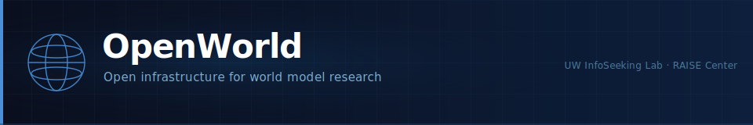

 [](https://InfoSeeking.github.io/WorldModelDemo/) 

# OpenWorld

OpenWorld is an open-source SDK for evaluating, comparing, and adapting world models — built for researchers and developers without access to large-scale AI infrastructure.

---

## Quickstart

```python
from openworld.benchmarks import DemoClips
from openworld.metrics import ground_truth_silhouette
import numpy as np

clips = DemoClips.load()
embeddings = np.random.randn(clips.n_clips, 768)  # replace with real embeddings
score = ground_truth_silhouette(embeddings, clips.labels)
print(f'Silhouette: {score:.3f}')
```

Install with `pip install -e .` (PyPI release coming with v0.1). See docs/quickstart.md.

### Using your own model

```python
from openworld.models import VJEPA2  # or your own subclass of BaseWorldModel
model = VJEPA2.from_pretrained()
embeddings = model.embed(clips.videos)
```

Model adapters for V-JEPA 2, VideoMAE v2, and DreamerV3 are in development. See docs/adding_a_model.md to wrap your own.

---

## What You Can Do

- Evaluate any world model on standard benchmarks
- Run shortcut-detection interventions
- Measure latent structure (silhouette, invariance, NN geometry, centroid gap, DCI)
- Add your own model with a thin adapter
- Add your own benchmark

---

## Why This Matters

Tooling for large language models is mature: standardized benchmarks, evaluation harnesses, and model adapters are widely available. World models have not caught up. There is no agreed-upon benchmark format, no shared schema for physical scene data, and no lightweight framework that lets a researcher swap in a new model without rewriting infrastructure from scratch. As world models move from research curiosities to components in robotics, simulation, and embodied AI pipelines, that gap becomes a practical problem. OpenWorld is an attempt to close it incrementally, in the open — and to make SDK-level access available to developers who do not have large-scale infrastructure.

---

## Built with OpenWorld

- **WorldModelDemo:** [https://InfoSeeking.github.io/WorldModelDemo/](https://InfoSeeking.github.io/WorldModelDemo/) — Interactive benchmark for LLMs, vision models, and world models on physical scene clips.
- **Diagnostic study:** We used openworld to evaluate V-JEPA 2, VideoMAEv2, and DreamerV3 on IntPhys2. Findings: findings/. Preprint forthcoming.

---

## Roadmap

- **Phase 1:** SDK foundation, Summer 2026
- **Phase 2:** 3 domain adapters: climate, health, agriculture (Fall 2026 to Spring 2027)

See [ROADMAP.md](ROADMAP.md) for the full plan and current status.

---

## Who We Are

OpenWorld is developed by the [UW InfoSeeking Lab](https://infoseeking.org) and the [RAISE Center for Responsible AI](https://raise.uw.edu) at the University of Washington.

- **UW InfoSeeking Lab** studies how people seek, use, and make sense of information, with growing work on AI systems that model the physical and social world.
- **RAISE Center for Responsible AI** advances research on AI that is safe, accountable, and grounded in real-world constraints.

See the project website and [CONTRIBUTING.md](CONTRIBUTING.md) for more about the team and how to get involved.

---

## How to Contribute

Read [CONTRIBUTING.md](CONTRIBUTING.md) for guidelines on submitting data, code, or documentation.

